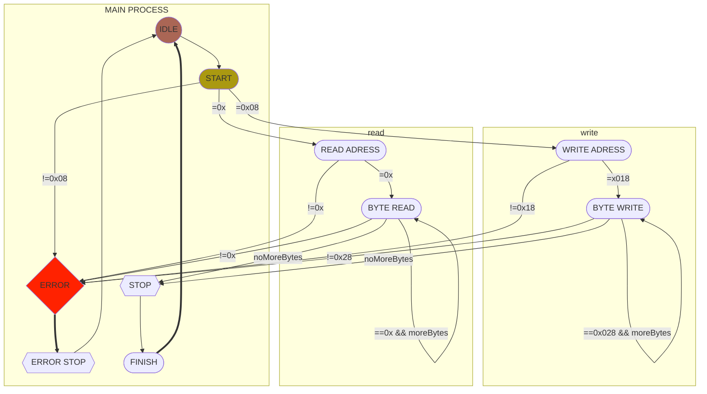

# State Diagramm

```mermaid
graph TD;
    idle((IDLE))
    error{ERROR}
    start([START])
    adressWrite([WRITE ADRESS])
    adressRead([READ ADRESS])
    byteWrite([BYTE WRITE])
    byteRead([BYTE READ])
    stop{{STOP}}
    stopEr{{ERROR STOP}}
    finish([FINISH])

    subgraph main [MAIN PROCESS]
        direction TB;
        idle:::idleClass --> start;
        start:::startClass -->|!=0x08| error;
        error:::errorClass ==> stopEr;
        stopEr --> idle;
        finish ==> idle;
        stop --> finish;
    end

    subgraph write
        start --> |=0x08| adressWrite;
        adressWrite --> |=x018| byteWrite;
        adressWrite --> |!=0x18| error;
        byteWrite --> |!=0x28| error;
        byteWrite --> |==0x028 && moreBytes| byteWrite;
        byteWrite --> |noMoreBytes| stop;
    end

%% Read 1 state more -> Last Byte
    subgraph read
        start --> |=0x| adressRead;
        adressRead --> |=0x| byteRead;
        adressRead --> |!=0x| error;
        byteRead --> |!=0x| error;
        byteRead --> |==0x && moreBytes| byteRead;
        byteRead --> |noMoreBytes| stop;
    end


    %% Class Defs
    classDef idleClass fill:#A65;
    classDef errorClass fill:#F20;
    classDef startClass fill:#A91;

```
